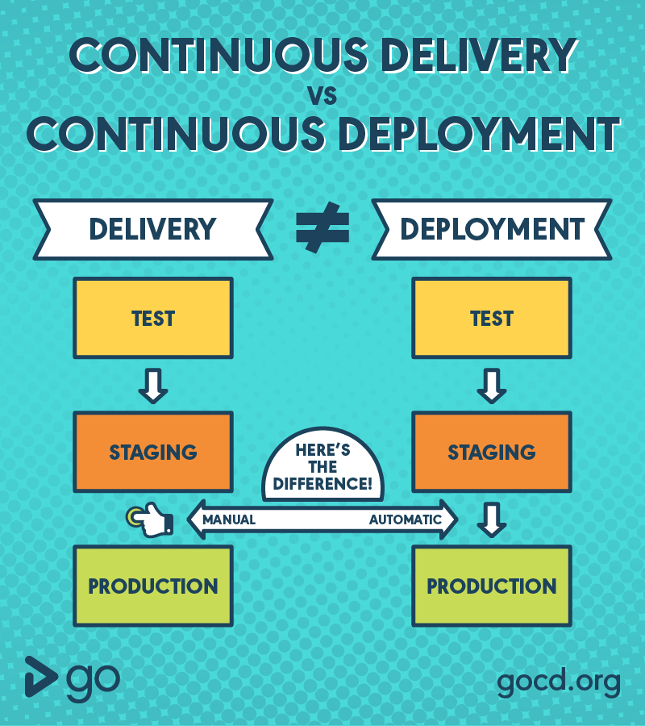

#### Jenkins:

- install java first
- install jenkins

```bash
service jenkins status
```

##### Setup jenkins.local:

- In cmd add this line as root user

```bash
    vi /etc/hosts
    echo "<private_ip> jenkins.local" >> /etc/hosts
```

- Now go to browser and access `http://jenkins.local:8080`

- enter password

- install initial libraries
- enter local url

#### Jenkins Dashboad:

- creat new job
- configure it you can try all the linux cmd here
- save and build and see the output console
- again go and configure the jobs
- again save and build and see output console

**Note**:
this is jenkins root folder where you can find everything `/var/lib/jenkins/`

#### Search bar: (shortcuts)

- if you enter proper name of project you will redirect other wise list out
- trick to go 5th build of jobs -> `job_name 5`
- trick to go console output of 5th build -> `job_name 5 console`
- last failed build -> `job_name last-failed build`

#### Manage Jenkins:

**1. system configure**:

#### role based Authorization:

**Plugin** - role based access

- go to security change authentication to role-based access
- now go to manage role
- create role i.e. developer , tester, devops etc
- assign role

#### git based build (two ways):

**1st way**: - create job write cmd to clone the git repos then build it

**2nd way**: - create job through source management by selected as **git**

#### Built in triggers:

**1. Trigger builds remotely (e.g., from scripts)**

- if you want to trigger your build though script.

**Plugin** - build authorization token rule

**cmd**

```bash
# local
curl http://jenkins.local:8080/buildByToken/build?job=demo2\&token=demo2Token


# on private
http://jenkins.local:8080/buildByToken/build?job=demo2&token=demo2Token
```

**2. Build after other projects are built**

- if you want to auto trigger any job after success build of other job.

- this can be used where success test should auto run deploy to server

**3. Build after other projects are built**

- if you want to auto trigger any job after success build of other job.

- this can be used where success test should auto run deploy to server

**3.2 Build even the first build is failed**

**3.3 Build even the first build is unstable**

- unstable- go to advance -> set exit code 10 and also mention in shell cmd save

**4 Build periodically**

**cron jobs**

- it will trigger the build at every 2 min (here)
- set interval to build periodically
  ex - H/2\*\*\*\*

**4 Poll SCM**

**cron jobs**

- It will trigger build at set interval only iff code changes found.
- set interval to build periodically
  ex - H/2\*\*\*\*

**4 GitHub hook trigger for GITScm polling**

- In this whenever github detected in change it raise the event using **webhook** and send notification to jenkins , then jenkins start building corresponding jobs.

**note**:

- this we will see at last

#### How to print OR use some Env variable at script:

- for ex- we need build id or number to identify the artifact of each build

```bash
echo "Build id: ${BUILD_ID}"
echo "Build Number: ${BUILD_NUMBER}"

```

#### SET GLOBAL VAR:

- GO TO SYS CONFIGURE -> SET GLOBAL VAR -> CREATE A JOB -> PRINT GLOBAL_VAR FROM SHELL

#### Build with parameter:

- if we need to take input from user then we can use parameter

**Types**

1. string
2. boolean
3. list
4. ....
5. file - important to upload .env file

#### Build Env:

**1. Abort the build if stuck:**

- usecases: infinite loop

**1.1 abort if take more time than need**

**1.2 fail the build**

Q. abort build if takes more than 3 min

- pass this in the shell while creating job

```bash
sleep 240
```

see output

- should be aborted

**1.2. print the timestamp:**

**Execute concurrent build if necessary**

**retry count** - retry to build specific no of times

**throttle build** - provoke to build some spefied times (that you set)

**use custom workspace** - can give custom dir name to save jobs output

**display name** - to change job name and project name

#### upstream & downstream:

**upstream** - parent job
**downstream** - child job

-trigger - when other are build then it also

- Here we have many options
  - block child that when parent is building child can't build
  - same with parent

#### create first jenkins pipeline:

**Plugin** - build pipeline

**ci/cd** - continuous integration, continuous deployment

- create child job
- create parent job and select post build to build child job
- go to dashboad -> click on + -> create new pipeline -> select intial job as parent
- run the job

**ci/cd** - continuous integration, continuous delivery

- create child job
- create parent job and select post build -> manual build child job
- go to dashboad -> click on + -> create new pipeline -> select intial job as parent
- run the job

#### continuous deployment vs continuous delivery



#### Project Implementation:

**Steps:**

- unit test -> build -> deploy to test server -> deploy to prod server

#### Master -Slave Architecture:

- for big org, may runs many pipeline simultaneously for that we need to establish master-slave arch
-
