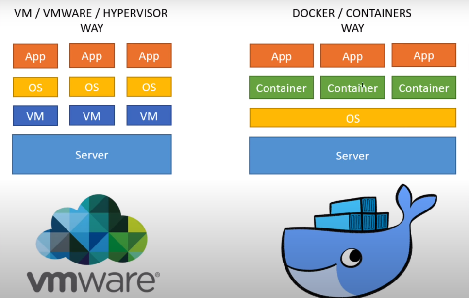

#### Docker:

##### Docker vs VM_ware:



###### cmd:

```bash
docker --version # to see docker version
docker info # to see docker info i.e. no of containers, running , pause, stop etc.

docker container run -it -p 80:80 nginx # -it - interactive mode, -p - publish,  port 80, nginx -

docker container ls # this will show the running container.
docker container ls -a # this will show all the running container.

docker container rm 95a # to delete container 95a is the first three char of id of that container.


docker container run -d -p 8080: 80 --name mynginx nginx # to run the specific container.

docker container run -d -p 8081: 80 --name myApache httpd # to run the specific container.


docker ps # to see all the running container.


```

###### Mysql container Env setup & run:

```bash
docker container run -d -p 8082: 80 --name mysql --env MYSQL_ROOT_PASSWORD=123456 mysql # to run the specific container.
```

```bash
docker container exec -it mynginx bash # to run mynginx
docker img build -t bradtraversy/nginx-website .

```

#### Image vs Container:

**Image**: - it contains all the artifact that need to run a application (source code, dependecies, etc).

- an immutable template that define how a container will be initialized.

**Container**: - A running instance of image is called container.
**Note**:

1. we can create as many instance as we want i.e. we can run many container of same image to balance load and performance optimization.

#### Docker Registry:

- docker hub contain all the images of different registries.

#### Docker Compose:

- a tool to run multiple container with single cmd

#### Port Binding:

```bash
docker container run -d -p 8081: 80 --name myApache httpd # to run the specific container.

```

- here we can access myApache service locally on port 8081 which is bind with port 80

**Note** :

- we can use any port on locally but standard is to use same port what the image uses.
- **docker run** - create new container everytimes we run this. we can see that by the cmd

```bash
docker ps -a
```

- so to better way to start earlier created container is by cmd

```bash
docker start 781e432432sfsd # 781e432432sfsd <id_of_container> here we can use name also to start and stop
docker stop 781e432432sfsd
```

#### public and private registries:

**1. public registries:**

- anyone can access from the web
- for ex - docker hub registries.

**2. private registries:**

- Belong to particular company, also provided by cloud providers.
- need to authenticate before access it.
- for ex
  - **aws has ECR** (Elastic Container Registry) - to create private registries.
  - **Nexus** : popular artifact repository manager.
  - **Docker Hub** : It also have feature of private docker registry.

#### Registry vs Repository:

1. Registry:

- a service providing storage.
- can be hosted on 3rd party cloud (aws, gcp, azure)

2. Repository:

- Collection of related repository with same name but different versions.
- Inside an registry we have collection of repository
- for ex - (my-app, my-service)

#### Custom Images:

1. BASE IMAGE - node - for js, tomcat- java,
