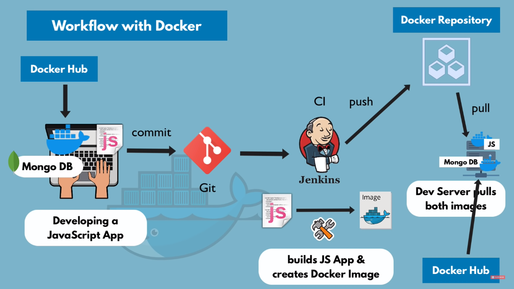

#### cmd:

```bash
docker run redis:4.3.2 # pull that and run '

docker run -p6000:6379 -d redis # detach
docker run -p6000:6379 -d redis --name redis_older #name
docker images


# troubleshooting cmd (imp)
docker logs <id> || <name>

docker exec -it <id> || <name> /bin/bash


```

#### Work flow

- proper workflow from developement to ci/cd to
  
