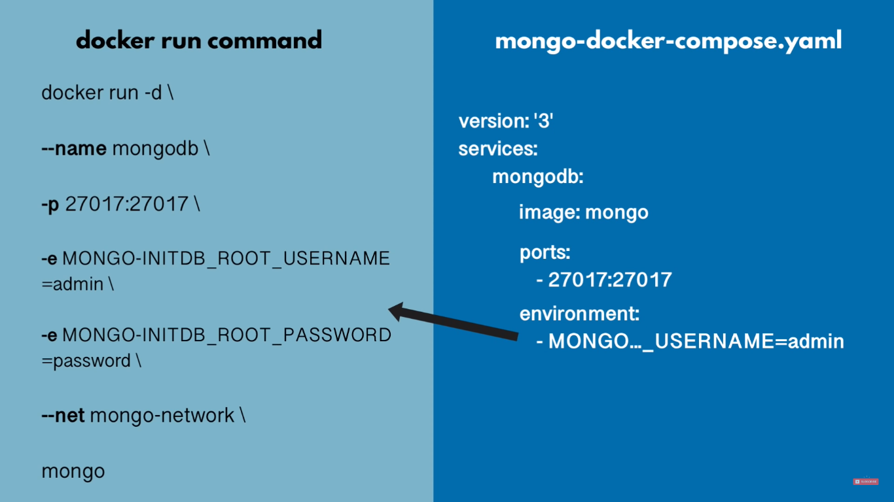
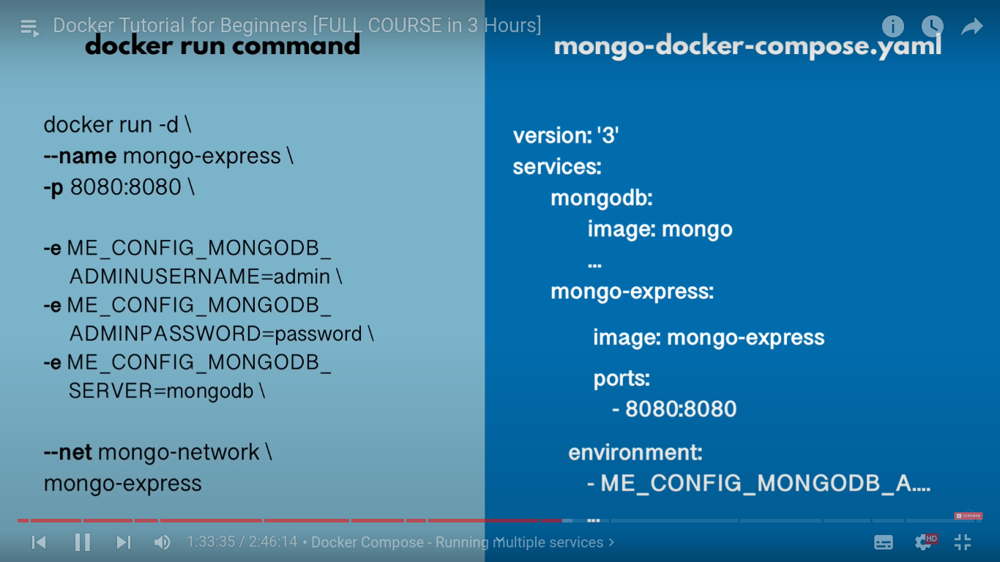

#### simple frontend/backend app with docker container:

**Docker Network**

```bash

docker pull mongo
docker pull mongo-express

# docker networking
docker network ls # list all networks
docker network create mongo-network # create

```

- now to use this network we have to pass network during container creation.
  f

```bash

docker run -d \
> -p 27017:27017 \
> -e MONGO_INITDB_ROOT_USERNAME=admin \
> -e MONGO_INITDB_ROOT_PASSWORD=password \
> --name mongodb \
> --net mongo-network \
> mongo


# Now you can log the conatainer
docker logs <coantiner_id>
```

#### Now docker for express:

```bash
 docker run -d \
> -p 8081:8081 \
> -e ME_CONFIG_MONGODB_ADMINUSERNAME=admin \
> -e ME_CONFIG_MONGODB_ADMINPASSWORD=password \
> --net mongo-network \
> --name mongo-express \
> -e ME_CONFIG_MONGODB_SERVER=mongodb \
> mongo-express


# again log the mongo-express
docker logs <conatainer_id>
```

#### Docker Compose:

- To run multiple container with one cmd

**Let see the above run mongodb cmd to compose.yml**


**Let see the above run mongo-express cmd to compose.yml**


- here in the docker compose we don't need to set network , it already do or create common network for us.

- identation in yaml is important
