#### Kubernetes:

- It is open-source container orchestration tool
- developed by google
- help to manage containerize applications in different deployment environment.

#### what services container orchestration tool offer

- High availability or no runtime
- scalability or high performance
- disaster recovery or restore and backup

#### Kubernetes Comoponents:

**1. pod and node**

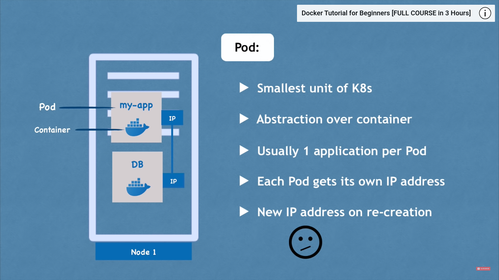

**2. service and ingress**

- service

  - it is need because pod ip can be change when pod dies or restarted
  - 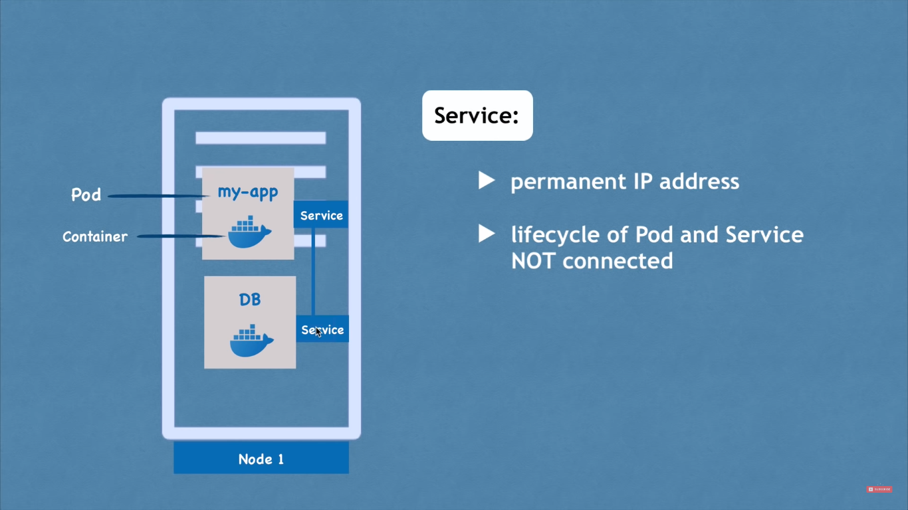

- internal & external service - It is not practical to use in real cases.
  

- Ingress
  - same as dns

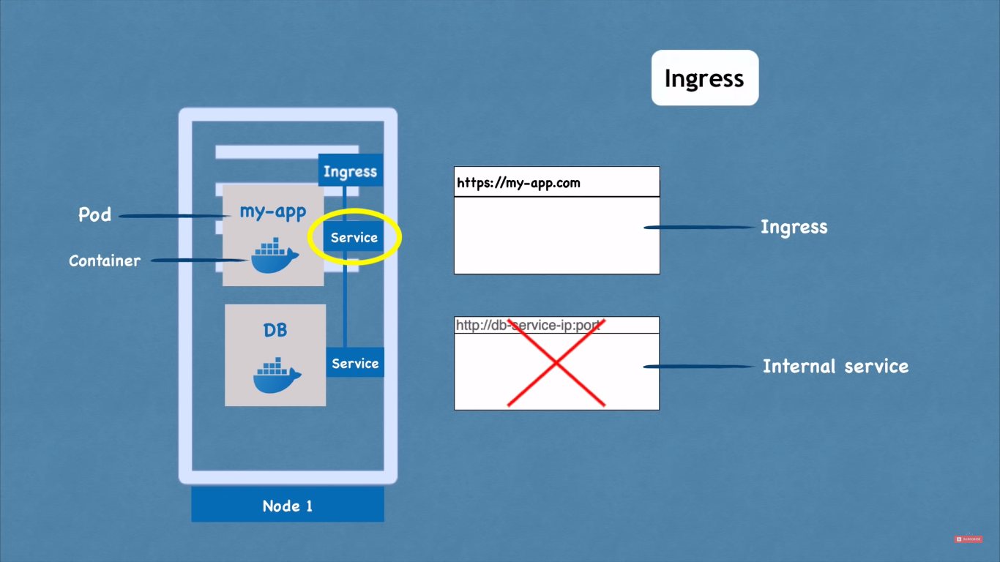

#### ConfigMap and Secret:

**1. ConfigMap** : External configuration file where all the configuration have.

see the ex-
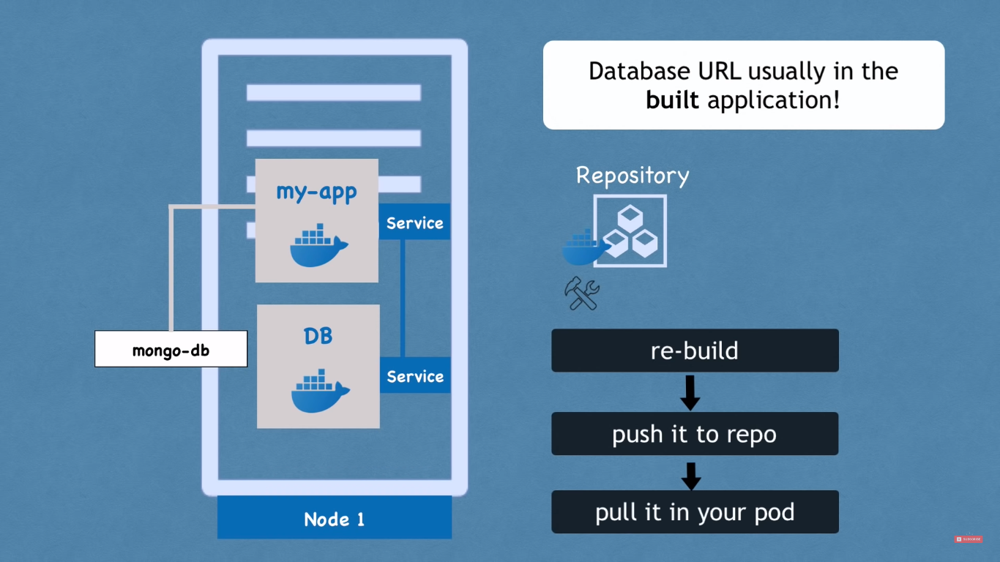

- now if we need to change something we do in configMap.yml file and it will be attached or applied to pod.

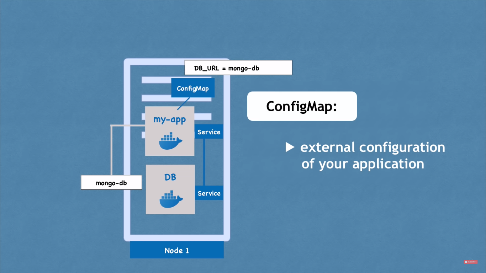

- But we don't put any sensitive info in config file for that we have

**2. Secret** :

- used to store secrets in encoded 64 bit.
  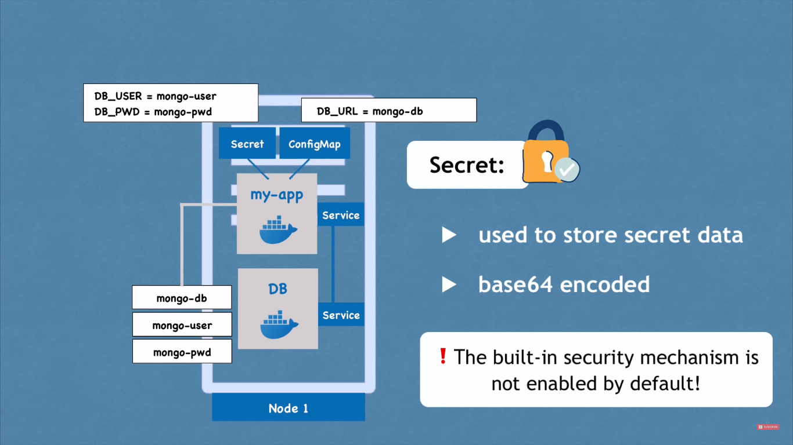

#### Volumes:

- It is require to persist data
  **Problem**: - if our db pod get fail then k8's auto create the new one but the data that previous db store will be loss

- we can think it as external hdd or storage device that can attach with the pod

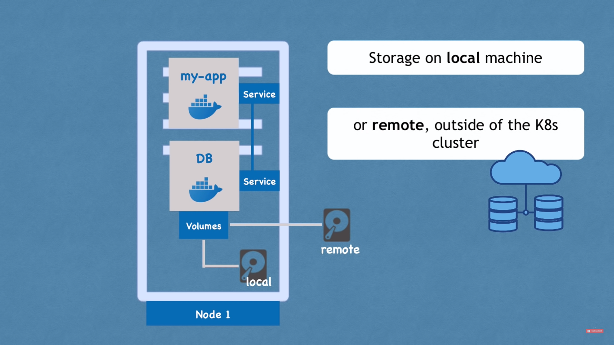

**Note**:

1. K8's doesn't provide any backup or data storage
2. you have to manage either locally or from the remote one.

#### Deployment and Stateful Set:

**1. Deployment**:
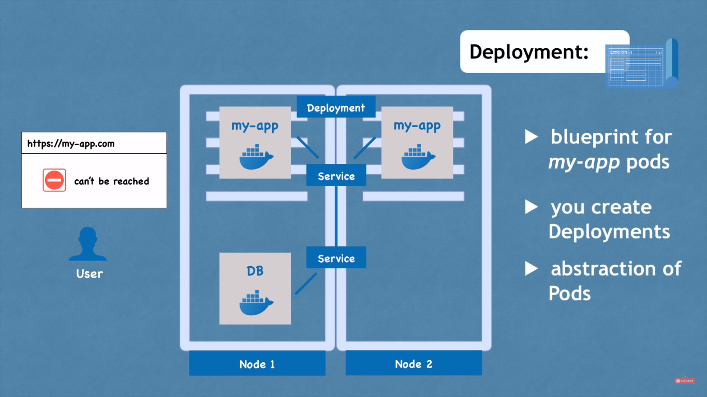
**problem statement**: suppose we have one pod of web-app which is running well, and suddently get fail due to some error. now user wouldn't be able to access and downtime get counted which impact business and seo as well.

- Therefore in deployment config file we define replica
- now if any pod get failed it will auto create new one and zero runtime get counted.
- all the replicas get interact with external through **service**
- now the service will forward to newly create pod

**2. stateful set**:
It is used with database replicas, for ex- replicating db can create incosisting of reading and writing data.

- for that there should be mechanism to handle this
  for that we use **stateful set**.

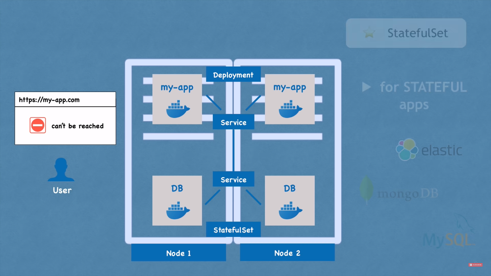

**Notes:**

- **Deployment** is used with stateless applications
- **Stateful set** is used with stateful applications for ex- db.

- but it is generally use db outline the cluster and just replicating client or api inside cluster.

#### K8's Architecture:

1. Nodes:
   - master
   - worker
2. how cluster is self managed

##### 1 Worker machine of k8's cluster

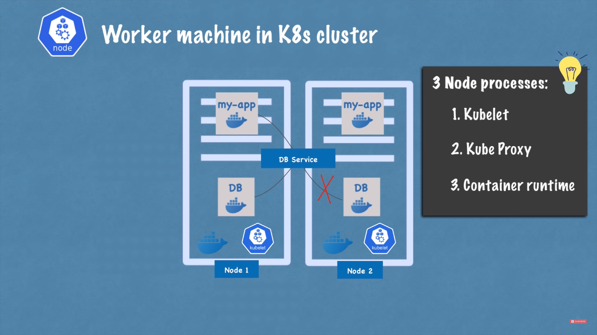

**Problem**:

- how to

  - interact with cluster
  - monitor
  - re-schedule/re-start pod?
  - join a new node

- This all managed by **master node**.

##### 2. Master machine Processes:

There are four master process used here.

**i. Apiserver**: This component provides the Kubernetes API interface. It exposes endpoints for users and client applications to interact with the Kubernetes cluster. It validates and processes API requests, such as creating, updating, and deleting resources like pods, services, and deployments.

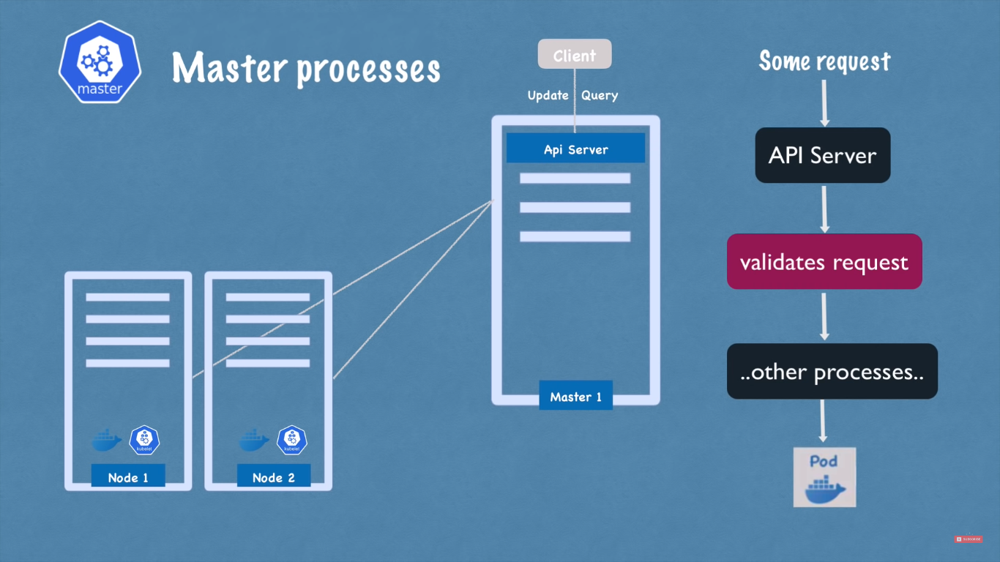

**ii. Scheduler**:
The scheduler is responsible for placing newly created pods onto suitable nodes in the cluster. It considers factors like resource requirements, node health, and affinity/anti-affinity rules when making scheduling decisions. The scheduler aims to optimize resource utilization and ensure high availability and performance of applications.

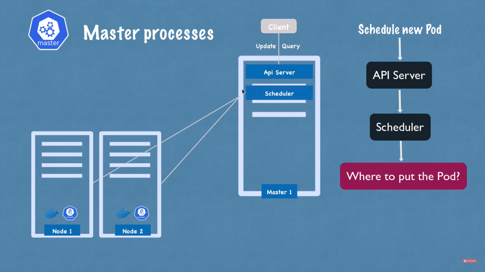
